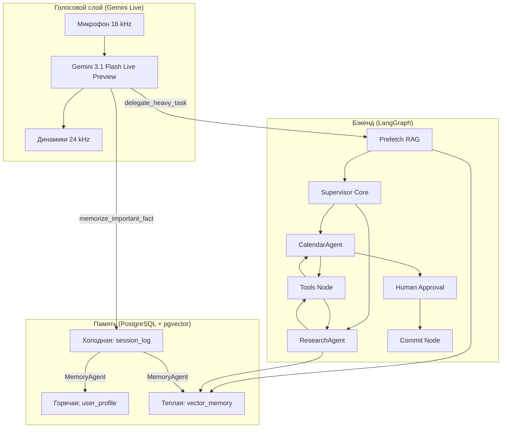

# J.A.R.V.I.S. — Just A Rather Very Intelligent System

Локальный голосовой ИИ-ассистент с мультиагентным бэкендом, долговременной памятью и интеграцией с Google Calendar. Работает на компьютере пользователя: голосовой интерфейс ведёт диалог в реальном времени, а сложные задачи делегирует внутренней системе специализированных агентов.

**Версия:** 0.7.0  
**Python:** 3.13+  
**Автор:** Vlad — hudakovvlad8@gmail.com

---

## Что умеет JARVIS

- **Голосовой диалог** через Gemini Live API: распознавание речи, синтез ответа, женский голос Aoede
- **Планирование и календарь** — чтение расписания, создание событий и задач в Google Calendar / Google Tasks
- **Поиск в интернете** — актуальная погода, рецепты, факты через Tavily API
- **Долговременная память** — трёхуровневая система с автоматической консолидацией фактов
- **Согласование планов** — сложные расписания сначала показываются черновиком, запись в календарь только после подтверждения
- **Терминальный UI** — ASCII-анимация, чат, статус системы, параллельный ввод с клавиатуры и микрофона

---

## Архитектура

JARVIS построен как **двухслойная система**: голосовой фронтенд и мультиагентный бэкенд.



### Голосовой слой

Модель `gemini-3.1-flash-live-preview` — это «лицо» ассистента. Она общается с пользователем, но **не выполняет** сложную логику самостоятельно. Вместо этого использует три инструмента:

| Инструмент | Назначение |
|---|---|
| `delegate_heavy_task` | Передаёт задачу внутреннему графу агентов (календарь, поиск, планирование) |
| `memorize_important_fact` | Сохраняет важный факт в холодную память для последующей консолидации |
| `force_memory_consolidation` | Принудительно запускает агент памяти |

Перед каждой сессией голосовой промпт дополняется **горячей памятью** пользователя — ключевыми фактами из профиля.

### Бэкенд (LangGraph)

Внутренний мозг работает на `gemini-3.1-flash-lite` и управляется графом состояний LangGraph:

1. **Prefetch Node** — перед обработкой запроса выполняет RAG-поиск по тёплой памяти и внедряет найденные факты в контекст
2. **Supervisor Core** — координатор без собственных инструментов; анализирует запрос и делегирует задачу одному специалисту за раз
3. **CalendarAgent** — планирование: читает расписание, находит свободные окна, формирует черновик, запрашивает согласование
4. **ResearchAgent** — исследования: сначала ищет в личной памяти, затем в интернете
5. **Tools Node** — выполняет вызванные инструменты
6. **Human Approval** — пауза графа для согласования черновика с пользователем через голосовой интерфейс
7. **Commit Node** — автоматическая запись одобренных событий и задач в Google Calendar

Лимит безопасности: **12 шагов** на один запрос. При превышении срабатывает `emergency_stop`.

### Агент памяти

Отдельный LLM-модуль (`MemoryLLMService`), который работает в фоне:

- Запускается автоматически после **3 минут** бездействия
- Может быть вызван вручную через `force_memory_consolidation`
- Берёт необработанные факты из `session_log`, анализирует их и распределяет:
  - **Горячая память** (`user_profile`) — имя, работа, ключевые проекты
  - **Тёплая память** (`vector_memory`) — предпочтения, детали, истории
  - Удаляет устаревшие ключи из горячей памяти
- Логи пишутся в `logs/jarvis.log` (основное приложение) и `logs/memory_agent.log` (агент памяти)

---

## Система памяти

| Уровень | Таблица | Что хранит | Как используется |
|---|---|---|---|
| Горячая | `user_profile` | Критичные факты (ключ → значение) | Подставляется в промпт голосового агента при каждом запуске |
| Тёплая | `vector_memory` | Текст + 768-dim эмбеддинг | Семантический RAG-поиск (prefetch, `search_user_memory`) |
| Холодная | `session_log` | Сырые факты и реплики сессии | Буфер перед консолидацией; поле `processed` отслеживает статус |

**Поток данных:**

```
Пользователь озвучивает факт
        ↓
memorize_important_fact → session_log (role: fact, processed: false)
        ↓
MemoryAgent (авто или вручную)
        ↓
┌───────────────────┬────────────────────┐
↓                   ↓                    ↓
user_profile    vector_memory      processed = true
(горячая)       (тёплая + embedding)
```

Эмбеддинги генерируются моделью `gemini-embedding-2` (768 измерений).

---

## Быстрый старт

### 1. Зависимости

- Python 3.13+
- [uv](https://docs.astral.sh/uv/) для управления пакетами
- PostgreSQL 16+ с расширением [pgvector](https://github.com/pgvector/pgvector)
- Микрофон и динамики (PyAudio)

### 2. База данных

**Вариант A — Docker:**

```bash
cd src
docker compose up -d
```

Контейнер `jarvis_postgres` поднимает PostgreSQL с pgvector на порту `5432`.  
Параметры по умолчанию: user `postgres`, password `admin`, database `jarvis_memory`.

**Вариант B — локальный PostgreSQL:**

```sql
CREATE DATABASE jarvis_memory;
\c jarvis_memory
CREATE EXTENSION vector;
```

Таблицы создаются автоматически при первом запуске (`init_db()`).

### 3. Переменные окружения

Создайте файл `.env` в корне проекта:

```env
# Обязательные
GEMINI_API_KEY=your_gemini_api_key
TAVILY_API_KEY=your_tavily_api_key

# База данных (значения по умолчанию показаны)
DB_USER=postgres
DB_PASSWORD=admin
DB_HOST=localhost
DB_PORT=5432
DB_NAME=jarvis_memory
```

### 4. Google Calendar (опционально)

Для работы с календарём и задачами:

1. Создайте проект в [Google Cloud Console](https://console.cloud.google.com/)
2. Включите Google Calendar API и Google Tasks API
3. Создайте OAuth 2.0 credentials (Desktop app)
4. Положите `credentials.json` в `src/`
5. При первом запуске пройдите OAuth — токен сохранится в `src/token.json`

Поддерживаемые категории календарей: университет, учеба дома, работа/проекты, хорошие привычки, спорт, встречи, быт.

### 5. Запуск

**Windows:**

```bash
run.bat
```

**Или напрямую:**

```bash
uv run src/main.py
```

Скрипт `run.bat` устанавливает размер терминала 120×30 и запускает приложение. Рекомендуется держать окно терминала именно такого размера — UI рассчитан на него.

---

## Типичные сценарии

### Простой запрос к календарю

> «Запиши стрижку на завтра в 15:00»

Голосовой агент → `delegate_heavy_task` → Supervisor → CalendarAgent → `calendar_add_event_tool` → результат озвучивается пользователю.

### Сложное планирование

> «Спланируй мне день: библиотека, спорт и ужин»

Supervisor → ResearchAgent (ищет график библиотеки, предпочтения в еде) → Supervisor → CalendarAgent (строит черновик) → `request_user_approval_tool` → голосовой агент зачитывает план → пользователь говорит «да» → `commit_node` записывает в календарь.

### Запоминание фактов

> «Я аллергичен на орехи»

Голосовой агент → `memorize_important_fact` → `session_log` → через некоторое время MemoryAgent переносит в `vector_memory`.

### Поиск информации

> «Какая сегодня погода?»

Supervisor → ResearchAgent → `internet_search_tool` (Tavily) → результат возвращается голосовому агенту.

---

## Инструменты бэкенда

| Инструмент | Агент | Описание |
|---|---|---|
| `time_tool` | — | Текущая дата и время (русские названия месяцев и дней) |
| `calendar_get_schedule_tool` | Calendar | Расписание по календарям и задачам за период |
| `calendar_add_event_tool` | Calendar / Commit | Создание события в Google Calendar |
| `calendar_add_task_tool` | Calendar / Commit | Создание задачи в Google Tasks |
| `request_user_approval_tool` | Calendar | Отправка черновика на согласование |
| `search_user_memory` | Research | RAG-поиск по тёплой памяти с декомпозицией запроса |
| `internet_search_tool` | Research | Веб-поиск через Tavily API |

---

## Структура проекта

```
jarvis/
├── pyproject.toml          # Зависимости и метаданные
├── uv.lock                 # Lockfile
├── run.bat                 # Скрипт запуска (Windows)
├── README.md
└── src/
    ├── main.py             # Точка входа
    ├── bootstrap.py        # Сборка зависимостей (DI)
    ├── docker-compose.yml  # PostgreSQL + pgvector
    └── jarvis/
        ├── config/         # Настройки, промпты, интерфейсы
        ├── core/           # Движок, граф, агент памяти, маршрутизация
        ├── db/             # Модели, репозиторий, инициализация БД
        ├── front/          # Терминальный UI и рендер
        ├── handling/       # Ввод (микрофон, клавиатура) и вывод (экран, аудио)
        ├── services/     # Gemini, Live API, Calendar, Tavily, Embeddings
        ├── tools/          # Инструменты агентов
        └── utils/          # Логирование, 3D-математика для анимации
```

---

## Зависимости

| Пакет | Назначение |
|---|---|
| `google-genai` | Gemini API (Live + Embeddings) |
| `langchain-google-genai` | LangChain-обёртка для внутреннего LLM |
| `langgraph` | Граф состояний мультиагентной системы |
| `tavily-python` | Веб-поиск |
| `google-api-python-client` | Google Calendar / Tasks |
| `google-auth-oauthlib` | OAuth2 для Google |
| `sqlalchemy` + `asyncpg` | Асинхронная работа с PostgreSQL |
| `pgvector` | Векторный поиск в БД |
| `blessed` | Терминальный UI |
| `pyaudio` | Захват и воспроизведение аудио |
| `numpy` | 3D-анимация ASCII-тора |
| `dotenv` | Загрузка `.env` |

Установка:

```bash
uv sync
```

---

## Конфигурация

Основные настройки находятся в `src/jarvis/config/`:

- **`settings.py`** — модели LLM, системные промпты агентов, параметры БД, пути к Google credentials
- **`ui_config.py`** — FPS анимации, размеры терминала, параметры ASCII-тора
- **`interfaces.py`** — абстрактные базовые классы (LLM, UI, Tools, Repository и др.)

Модели по умолчанию:

| Роль | Модель |
|---|---|
| Внутренний LLM (агенты) | `gemini-3.1-flash-lite` |
| Голосовой интерфейс | `gemini-3.1-flash-live-preview` |
| Эмбеддинги | `gemini-embedding-2` (768-dim) |
| Агент памяти | `gemini-3.1-flash-lite` (отдельный экземпляр) |

---

## Безопасность

Следующие файлы **не коммитятся** в репозиторий (см. `.gitignore`):

- `.env` — API-ключи и пароли
- `credentials.json`, `token.json` — Google OAuth
- `logs/` — файлы логов (`jarvis.log`, `memory_agent.log`)

---

## Примечания

- Проект ориентирован на **Windows** (`WindowsSelectorEventLoopPolicy` для asyncio)
- Терминал рекомендуется держать размером **120×30** символов
- PostgreSQL с pgvector **обязателен** — без него память не работает
- Tavily API **обязателен** для ResearchAgent — без ключа веб-поиск вернёт ошибку конфигурации
- Голосовой агент обращается к пользователю «сэр» и использует женский род; внутренние агенты работают в сухом техническом стиле без вежливости

---

*JARVIS — уважительный, слегка ироничный, уверенный и лаконичный голосовой ассистент, работающий локально на компьютере своего создателя.*
