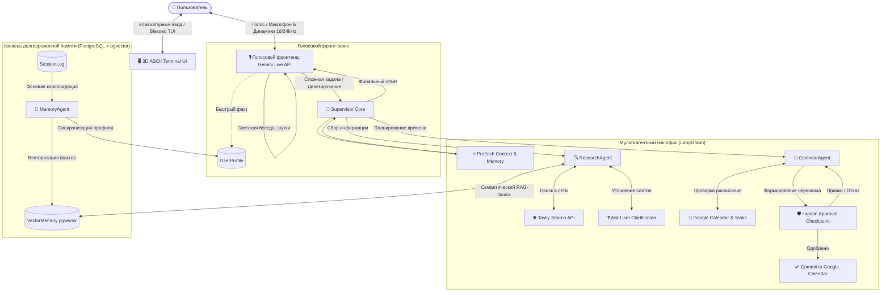

# 🤖 J.A.R.V.I.S. (Just A Rather Very Intelligent System)

<div align="center">


**Локальный голосовой ИИ-ассистент с ультранизкой задержкой, мультиагентной оркестрацией LangGraph, трёхуровневой памятью (RAG + pgvector) и процедурным 3D ASCII-интерфейсом.**

[Особенности](#-ключевые-особенности) • [Архитектура](#-архитектура-системы) • [Быстрый старт](#-быстрый-старт) • [Конфигурация](#-конфигурация-и-api-ключи) • [Структура проекта](#-структура-проекта) • [Примеры работы](#-сценарии-использования)

</div>

---

> [!WARNING]
> **Важное уведомление о сетевом доступе:**
> Проект активно использует **Google Gemini Live API** и **Gemini 3.1 Flash**. При нахождении в регионах с ограничениями доступа к сервисам Google AI Studio убедитесь, что перед запуском у вас активно стабильное соединение через VPN / прокси.

---

## 🌟 Ключевые особенности

- 🎙️ **Мгновенный голосовой диалог (Front-of-House):**
  Потоковый двусторонний аудиообмен в реальном времени на базе **Gemini Live API** (`gemini-3.1-flash-live-preview`). Высокое качество синтеза речи (голос *Aoede*), живая реакция на перебивания, разговорные филлеры во время раздумий и естественный темп речи.

- 🧠 **Мультиагентное ядро (Back-Office):**
  Оркестрация сложных задач на базе **LangGraph** с координатором **Supervisor Core** (`gemini-3.1-flash-lite`) и специализированными агентами:
  - **`CalendarAgent`**: вычисляет временные интервалы, анализирует занятость, бронирует слоты с буфером на дорогу и отдых.
  - **`ResearchAgent`**: собирает факты в сети, проверяет погоду, извлекает персональные вкусы из памяти и запрашивает уточнения при нехватке параметров.
  - **`MemoryAgent`**: фоновый агент структурирования и актуализации памяти.

- 🛡️ **Human-in-the-Loop (HITL) планирование:**
  Ассистент никогда не испортит ваше расписание самовольными действиями. При формировании плана дня или встреч создается интерактивный черновик (`draft_plan`). Джарвис озвучивает предложение и фиксирует изменения в Google Calendar **только после вашего явного подтверждения**.

- 💾 **Трёхуровневая архитектура памяти:**
  - **Горячая память (`UserProfile`)**: ключевые факты (имя, профессия, рабочий стек, статус), мгновенно доступные в контексте каждого запроса.
  - **Тёплая память (`VectorMemory`)**: семантическое векторное хранилище на базе **PostgreSQL + pgvector** (эмбеддинги `text-embedding-004`), хранящее привычки, вкусы и контекст прошлых обсуждений.
  - **Холодная память (`SessionLog`)**: сырые транскрипты и логи диалогов с автоматической нормализацией относительного времени в абсолютные даты (*Temporal Resolution*) и фильтрацией системного шума.

- 📅 **Интеграция с сервисами Google:**
  Полноценная синхронизация с **Google Calendar API** и **Google Tasks API** через локальный OAuth 2.0 (поиск окон, создание задач и событий).

- 🌐 **Глубокий интернет-поиск:**
  Интеграция с **Tavily Search API** для извлечения свежих фактов, прогноза погоды, новостей и рецептов с фильтрацией галлюцинаций.

- 🖥️ **Ретрофутуристичный 3D Terminal UI:**
  Консольный интерфейс на базе **Blessed** и **NumPy**: процедурная вращающаяся 3D-модель (ASCII Donut/Sphere) с расчетом света и теней, динамическое изменение скорости анимации в зависимости от статуса мышления, окно сообщений и поддержка ввода с клавиатуры.

---

## 🏗 Архитектура системы

Система разделена на два изолированных, взаимодействующих контура: **быстрый голосовой фронтенд** и **аналитический мультиагентный бэкенд**.



---

## 📋 Системные требования

- **Операционная система:** Windows 10/11, macOS или Linux.
- **Python:** версия **`3.13`** или выше.
- **Менеджер пакетов:** [**`uv`**](https://docs.astral.sh/uv/) (рекомендуется) или стандартный `pip`.
- **Служба контейнеризации:** [Docker Desktop](https://www.docker.com/) / Docker Compose (для подъема PostgreSQL с pgvector).
- **Оборудование:** рабочий микрофон и аудиовыход (динамики / наушники).

---

## 🚀 Быстрый старт

### 1. Клонирование репозитория

```bash
git clone https://github.com/your-username/jarvis.git
cd jarvis
```

### 2. Установка зависимостей через `uv`

Проект использует современный и сверхбыстрый менеджер пакетов `uv`:

```bash
# Установка uv (если еще не установлен)
# Windows (PowerShell):
powershell -c "irm https://astral.sh/uv/install.ps1 | iex"

# Создание виртуального окружения и установка зависимостей
uv sync
```

> *Если вы предпочитаете стандартный `pip`:*
> ```bash
> python -m venv .venv
> source .venv/bin/activate  # На Windows: .venv\Scripts\activate
> pip install .
> ```

### 3. Запуск векторной базы данных (PostgreSQL + pgvector)

В папке `src/` подготовлен готовый манифест `docker-compose.yml`:

```bash
docker compose -f src/docker-compose.yml up -d
```

Команда запустит контейнер `jarvis_postgres` с расширением `pgvector` на порту `5432`.

---

## 🔧 Конфигурация и API-ключи

### 1. Файл переменных окружения (`.env`)

Скопируйте пример конфигурационного файла `.env.example` в корень проекта или в папку `src/`:

```bash
cp .env.example .env
# или на Windows:
copy .env.example .env
```

Заполните переменные вашими ключами:

```env
# ==========================================
# J.A.R.V.I.S. Environment Variables
# ==========================================

# 1. Google Gemini API Key (Gemini Live и Flash)
# Получить ключ: https://aistudio.google.com/app/apikey
GEMINI_API_KEY=AIzaSy...

# 2. Tavily Search API Key (веб-аналитика для ResearchAgent)
# Получить ключ: https://tavily.com/
TAVILY_API_KEY=tvly-...

# 3. Параметры подключения к PostgreSQL
DB_USER=postgres
DB_PASSWORD=admin
DB_HOST=localhost
DB_PORT=5432
DB_NAME=jarvis_memory
```

### 2. Подключение Google Calendar & Tasks API

Для управления событиями и задачами требуется клиентский токен OAuth 2.0:

1. Перейдите в [Google Cloud Console](https://console.cloud.google.com/).
2. Создайте новый проект (например, `Jarvis-Assistant`).
3. В разделе **APIs & Services > Library** включите:
   - **Google Calendar API**
   - **Google Tasks API**
4. В разделе **APIs & Services > OAuth consent screen**:
   - Выберите тип **External** и укажите базовую информацию.
   - Добавьте свой Google-аккаунт в список **Test Users** (Тестовые пользователи).
5. В разделе **APIs & Services > Credentials**:
   - Нажмите **Create Credentials** -> **OAuth client ID**.
   - Выберите тип приложения: **Desktop app**.
   - Скачайте сгенерированный JSON-файл.
6. Переименуйте скачанный файл в `credentials.json` и поместите его в папку `src/credentials.json`.
7. При первом запуске откроется окно браузера для предоставления разрешений. После авторизации в папке `src/` автоматически создастся файл `token.json`, и повторная авторизация не потребуется.

---

## ▶️ Запуск ассистента

### Вариант А: Быстрый запуск на Windows (рекомендуется)
Дважды щелкните по файлу **`run.bat`** или выполните в консоли:

```cmd
run.bat
```
*(Скрипт настроит удобные размеры окна консоли 120x30, заголовок и запустит движок).*

### Вариант Б: Прямой запуск через `uv`
```bash
uv run src/main.py
```

После старта запустится 3D-интерфейс, Джарвис поприветствует вас голосом и перейдет в режим ожидания команд.

---

## 📂 Структура проекта

```text
jarvis/
├── pyproject.toml              # Метаданные проекта и зависимости uv
├── run.bat                     # Быстрый стартер для Windows Terminal
├── .env.example                # Шаблон переменных окружения
├── README.md                   # Документация проекта
└── src/
    ├── main.py                 # Главная точка входа приложения
    ├── bootstrap.py            # Фабрика сборки и внедрения зависимостей (IoC)
    ├── docker-compose.yml      # Манифест PostgreSQL + pgvector
    ├── credentials.json        # Google OAuth 2.0 client secret (создается пользователем)
    ├── token.json              # Сохраненный токен сессии Google API (генерируется)
    └── jarvis/
        ├── config/             # Конфигурационные файлы, промпты и интерфейсы
        │   ├── settings.py     # Модели, системные промпты агентов, URL базы данных
        │   ├── ui_config.py    # Настройки FPS, геометрии и 3D-шейдинга
        │   └── constants.py    # Локализация дат и календарные константы
        ├── core/               # Архитектурное ядро и агенты
        │   ├── engine.py       # JarvisEngine: координатор очередей аудио и событий
        │   ├── graph.py        # LangGraph: граф состояний, ноды и маршрутизация
        │   ├── nodes.py        # Реализация нод агентов и системных переходов
        │   ├── routing.py      # Условные переходы между агентами
        │   ├── state.py        # Описание состояния графа TaskState
        │   └── memory_agent.py # Фоновый агент консолидации памяти
        ├── db/                 # Слой работы с базой данных
        │   ├── database.py     # Инициализация SQLAlchemy и расширения pgvector
        │   ├── models.py       # Схемы таблиц: UserProfile, VectorMemory, SessionLog
        │   └── repository.py   # Асинхронный репозиторий для CRUD и векторного поиска
        ├── front/              # Визуальный терминальный интерфейс
        │   ├── ui.py           # Blessed TUI: рендеринг буферов, чата и статусов
        │   └── render.py       # JarvisUI: асинхронный цикл отрисовки кадров
        ├── handling/           # Обработка ввода и вывода
        │   ├── input_handler.py# Захват микрофона (PyAudio 16kHz) и клавиатурный ввод
        │   └── output_handler.py# Воспроизведение звука (PyAudio 24kHz)
        ├── services/           # Интеграции с внешними API
        │   ├── gemini.py       # Клиент LangChain Google GenAI
        │   ├── gemini_live.py  # Realtime WebSocket сессия Gemini Live API
        │   ├── calendar.py     # Обёртка над Google Calendar & Google Tasks
        │   ├── embeddings.py   # Сервис вычисления векторных представлений
        │   ├── memory_llm.py   # Сервис вызова LLM для обработки фактов
        │   └── tavily.py       # Клиент поискового движка Tavily
        ├── tools/              # Инструменты агентов
        │   ├── calendar_tools.py # Инструменты чтения/записи расписания
        │   ├── research_tools.py # Инструменты интернет-поиска
        │   ├── memory_tools.py   # Инструменты поиска по векторной памяти
        │   ├── approval_tool.py  # Инструмент запроса одобрения (HITL)
        │   └── live_tools.py     # Инструменты голосового фронтенда
        └── utils/
            ├── logger.py       # Логирование в файлы и консоль
            └── math_3d.py      # Процедурная генерация 3D-геометрии (Donut/Sphere)
```

---

## 💬 Сценарии использования

### 1. Быстрый диалог и разговорная речь
> **Вы:** *«Привет, Джарвис, как самочувствие?»*  
> **Джарвис:** *«Системы функционируют в штатном режиме, сэр. Чем могу быть полезна сегодня?»*  
*(Обрабатывается голосовой моделью мгновенно, без задействования тяжелого бэкенда).*

### 2. Исследования с учетом ваших предпочтений
> **Вы:** *«Придумай, что приготовить на ужин на двоих, только быстро.»*  
> **Джарвис:** *«Секунду, сэр, сверяюсь с вашими предпочтениями...»*  
*(Джарвис обращается к `ResearchAgent`, извлекает из векторной памяти информацию о ваших вкусах, аллергиях или любимой кухне, при необходимости ищет рецепты в интернете через Tavily и возвращает адаптированный результат).*

### 3. Умное планирование с подтверждением (HITL)
> **Вы:** *«Запланируй завтра встречу с командой и тренировку.»*  
> **Джарвис:** *«Один момент, проверяю расписание на завтра...»*  
> **`CalendarAgent`** анализирует существующие события, находит оптимальные окна с перерывами и формирует черновик:  
> **Джарвис:** *«Сэр, я подготовила следующий график на завтра: 11:00 — командный синк (45 минут), 18:30 — тренировка в зале. Внести эти события в календарь?»*  
> **Вы:** *«Да, подтверждаю.»*  
> **Джарвис:** *«Записано в ваш Google Календарь. Приятного вечера!»*

### 4. Автоматическая консолидация памяти
> **Вы:** *«Кстати, я со следующего понедельника перехожу на проект на Rust.»*  
> Голосовой фронтенд вызывает `MemorizeFactTool`. Фоновый `MemoryAgent` нормализует относительную дату, обновит профиль пользователя (`current_stack: Rust`) и запишет факт в векторную память pgvector для будущих контекстов.

---

## ⌨️ Управление и горячие клавиши

| Действие | Способ | Описание |
| :--- | :--- | :--- |
| **Голосовой ввод** | Микрофон | Говорите в обычном разговорном темпе |
| **Текстовый ввод** | Клавиатура + `Enter` | Отправка команды Джарвису текстом в TUI |
| **Редактирование** | `Backspace` | Стирание введенных символов в строке ввода |
| **Завершение работы** | `Ctrl + C` | Корректная остановка аудиопотоков, циклов и закрытие БД |

---

## 🗺 Дорожная карта (Roadmap)

- [x] Двусторонний голосовой стриминг через Gemini Live API
- [x] Мультиагентный оркестратор LangGraph со специалистами
- [x] Двухэтапное подтверждение действий в Google Calendar (Human-in-the-Loop)
- [x] Трёхуровневая гибридная память с pgvector и Temporal Resolution
- [x] Интерактивный 3D ASCII TUI терминал
- [ ] Поддержка локальных STT/TTS моделей (Whisper / Piper) для полностью автономного режима
- [ ] Интеграция с умным домом (Home Assistant / MQTT)
- [ ] Поддержка управления локальными файлами и терминалом разработчика
- [ ] Поддержка Telegram/мобильного интерфейса в качестве удаленного пульта

---

## 🤝 Вклад в проект (Contributing)

Пулл-реквесты приветствуются! Если вы хотите предложить улучшение или исправить ошибку:
1. Сделайте Fork репозитория.
2. Создайте feature-ветку (`git checkout -b feature/AmazingFeature`).
3. Зафиксируйте изменения (`git commit -m 'feat: Add amazing feature'`).
4. Отправьте ветку в удаленный репозиторий (`git push origin feature/AmazingFeature`).
5. Откройте **Pull Request**.

---

## 📄 Лицензия

Проект распространяется под лицензией **MIT**. Подробности в файле [LICENSE](LICENSE).

---

<div align="center">
  Разработано с ❤️ для энтузиастов искусственного интеллекта и голосовых ассистентов.
</div>
